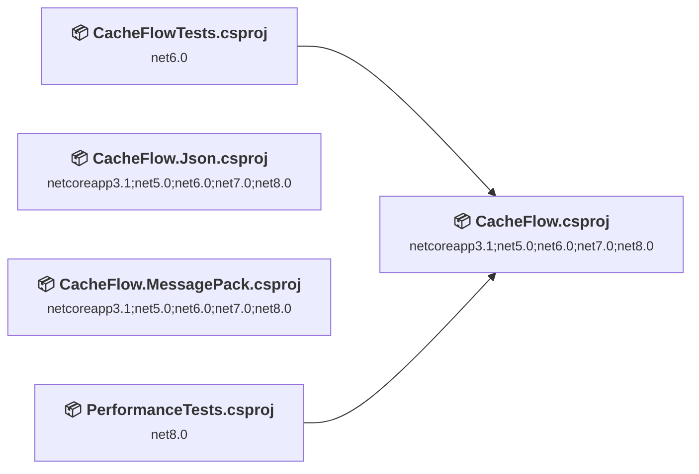
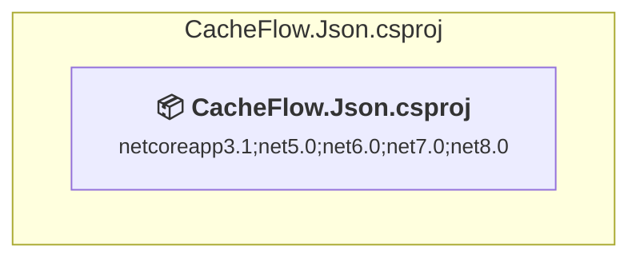
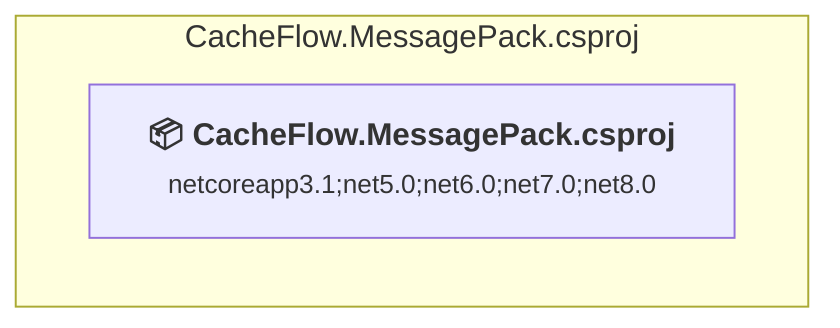
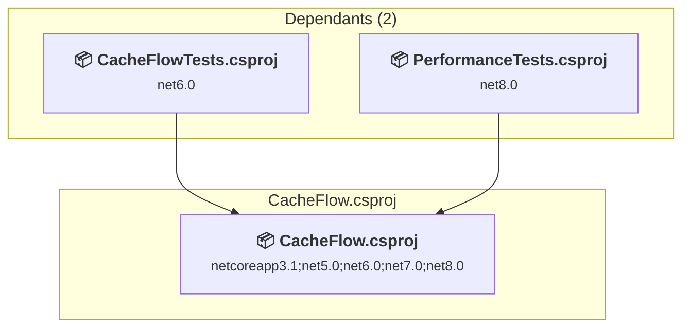
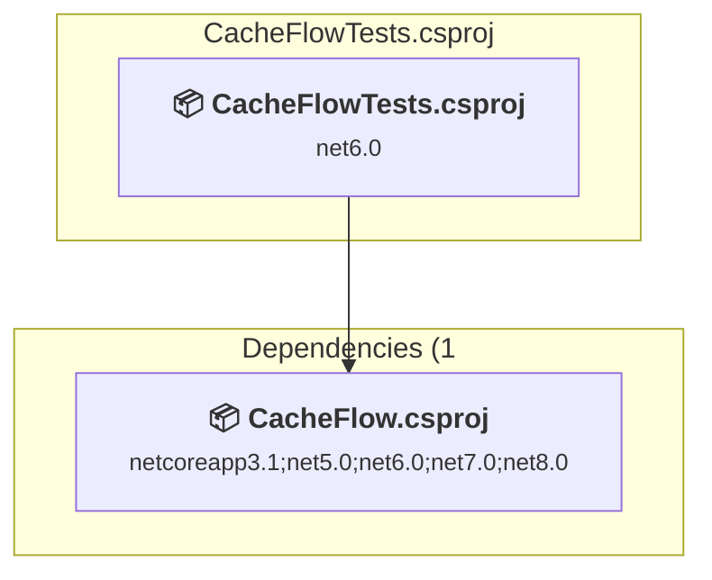
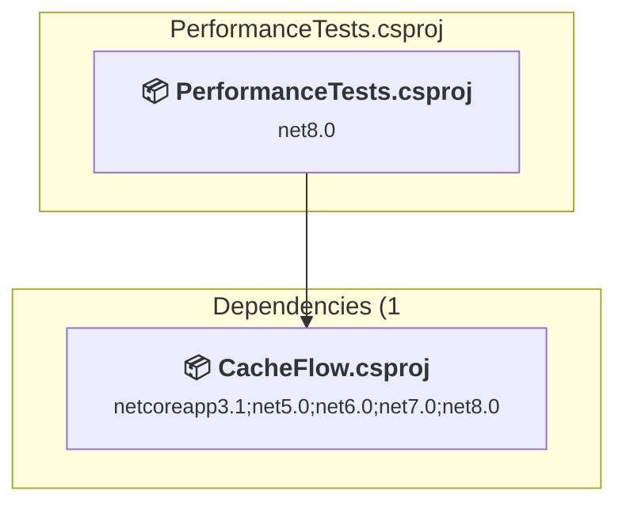

# Projects and dependencies analysis

This document provides a comprehensive overview of the projects and their dependencies in the context of upgrading to .NETCoreApp,Version=v10.0.

## Table of Contents

- [Executive Summary](#executive-Summary)
  - [Highlevel Metrics](#highlevel-metrics)
  - [Projects Compatibility](#projects-compatibility)
  - [Package Compatibility](#package-compatibility)
  - [API Compatibility](#api-compatibility)
- [Aggregate NuGet packages details](#aggregate-nuget-packages-details)
- [Top API Migration Challenges](#top-api-migration-challenges)
  - [Technologies and Features](#technologies-and-features)
  - [Most Frequent API Issues](#most-frequent-api-issues)
- [Projects Relationship Graph](#projects-relationship-graph)
- [Project Details](#project-details)

  - [CacheFlow.Json\CacheFlow.Json.csproj](#cacheflowjsoncacheflowjsoncsproj)
  - [CacheFlow.MessagePack\CacheFlow.MessagePack.csproj](#cacheflowmessagepackcacheflowmessagepackcsproj)
  - [CacheFlow\CacheFlow.csproj](#cacheflowcacheflowcsproj)
  - [CacheFlowTests\CacheFlowTests.csproj](#cacheflowtestscacheflowtestscsproj)
  - [PerformanceTests\PerformanceTests.csproj](#performancetestsperformancetestscsproj)

## Executive Summary

### Highlevel Metrics

| Metric | Count | Status |
| :--- | :---: | :--- |
| Total Projects | 5 | All require upgrade |
| Total NuGet Packages | 17 | 10 need upgrade |
| Total Code Files | 48 |  |
| Total Code Files with Incidents | 10 |  |
| Total Lines of Code | 4323 |  |
| Total Number of Issues | 41 |  |
| Estimated LOC to modify | 24+ | at least 0,6% of codebase |

### Projects Compatibility

| Project | Target Framework | Difficulty | Package Issues | API Issues | Est. LOC Impact | Description |
| :--- | :---: | :---: | :---: | :---: | :---: | :--- |
| [CacheFlow.Json\CacheFlow.Json.csproj](#cacheflowjsoncacheflowjsoncsproj) | netcoreapp3.1;net5.0;net6.0;net7.0;net8.0 | 🟢 Low | 2 | 0 |  | ClassLibrary, Sdk Style = True |
| [CacheFlow.MessagePack\CacheFlow.MessagePack.csproj](#cacheflowmessagepackcacheflowmessagepackcsproj) | netcoreapp3.1;net5.0;net6.0;net7.0;net8.0 | 🟢 Low | 1 | 0 |  | ClassLibrary, Sdk Style = True |
| [CacheFlow\CacheFlow.csproj](#cacheflowcacheflowcsproj) | netcoreapp3.1;net5.0;net6.0;net7.0;net8.0 | 🟢 Low | 6 | 4 | 4+ | ClassLibrary, Sdk Style = True |
| [CacheFlowTests\CacheFlowTests.csproj](#cacheflowtestscacheflowtestscsproj) | net6.0 | 🟢 Low | 3 | 20 | 20+ | ClassLibrary, Sdk Style = True |
| [PerformanceTests\PerformanceTests.csproj](#performancetestsperformancetestscsproj) | net8.0 | 🟢 Low | 0 | 0 |  | DotNetCoreApp, Sdk Style = True |

### Package Compatibility

| Status | Count | Percentage |
| :--- | :---: | :---: |
| ✅ Compatible | 7 | 41,2% |
| ⚠️ Incompatible | 1 | 5,9% |
| 🔄 Upgrade Recommended | 9 | 52,9% |
| ***Total NuGet Packages*** | ***17*** | ***100%*** |

### API Compatibility

| Category | Count | Impact |
| :--- | :---: | :--- |
| 🔴 Binary Incompatible | 0 | High - Require code changes |
| 🟡 Source Incompatible | 20 | Medium - Needs re-compilation and potential conflicting API error fixing |
| 🔵 Behavioral change | 4 | Low - Behavioral changes that may require testing at runtime |
| ✅ Compatible | 7473 |  |
| ***Total APIs Analyzed*** | ***7497*** |  |

## Aggregate NuGet packages details

| Package | Current Version | Suggested Version | Projects | Description |
| :--- | :---: | :---: | :--- | :--- |
| BenchmarkDotNet | 0.15.8 |  | [PerformanceTests.csproj](#performancetestsperformancetestscsproj) | ✅Compatible |
| FloxDc.CacheFlow | 1.13.0 |  | [CacheFlow.Json.csproj](#cacheflowjsoncacheflowjsoncsproj) [CacheFlow.MessagePack.csproj](#cacheflowmessagepackcacheflowmessagepackcsproj) | ✅Compatible |
| MessagePack | 2.5.187 |  | [CacheFlow.MessagePack.csproj](#cacheflowmessagepackcacheflowmessagepackcsproj) | ✅Compatible |
| Microsoft.Extensions.Caching.Abstractions | 8.0.0 | 10.0.7 | [CacheFlow.csproj](#cacheflowcacheflowcsproj) | NuGet package upgrade is recommended |
| Microsoft.Extensions.Caching.Memory | 6.0.0 | 10.0.7 | [CacheFlowTests.csproj](#cacheflowtestscacheflowtestscsproj) | NuGet package upgrade is recommended |
| Microsoft.Extensions.DependencyInjection.Abstractions | 8.0.2 | 10.0.7 | [CacheFlow.csproj](#cacheflowcacheflowcsproj) | NuGet package upgrade is recommended |
| Microsoft.Extensions.Logging.Abstractions | 8.0.3 | 10.0.7 | [CacheFlow.csproj](#cacheflowcacheflowcsproj) | NuGet package upgrade is recommended |
| Microsoft.Extensions.Options | 8.0.2 | 10.0.7 | [CacheFlow.csproj](#cacheflowcacheflowcsproj) | NuGet package upgrade is recommended |
| Microsoft.NET.Test.Sdk | 17.11.1 |  | [CacheFlowTests.csproj](#cacheflowtestscacheflowtestscsproj) | ✅Compatible |
| Microsoft.VisualStudio.DiagnosticsHub.BenchmarkDotNetDiagnosers | 18.7.37220.1 |  | [PerformanceTests.csproj](#performancetestsperformancetestscsproj) | ✅Compatible |
| Moq | 4.20.72 |  | [CacheFlowTests.csproj](#cacheflowtestscacheflowtestscsproj) | ✅Compatible |
| Newtonsoft.Json | 13.0.3 | 13.0.4 | [CacheFlow.Json.csproj](#cacheflowjsoncacheflowjsoncsproj) | NuGet package upgrade is recommended |
| System.Diagnostics.DiagnosticSource | 8.0.1 | 10.0.7 | [CacheFlow.csproj](#cacheflowcacheflowcsproj) | NuGet package upgrade is recommended |
| System.Text.Json | 8.0.5 | 10.0.7 | [CacheFlow.Json.csproj](#cacheflowjsoncacheflowjsoncsproj) [CacheFlow.MessagePack.csproj](#cacheflowmessagepackcacheflowmessagepackcsproj) | NuGet package upgrade is recommended |
| System.Text.Json | 8.0.6 | 10.0.7 | [CacheFlow.csproj](#cacheflowcacheflowcsproj) | NuGet package upgrade is recommended |
| xunit | 2.9.2 |  | [CacheFlowTests.csproj](#cacheflowtestscacheflowtestscsproj) | ⚠️NuGet package is deprecated |
| xunit.runner.visualstudio | 3.0.0-pre.42 |  | [CacheFlowTests.csproj](#cacheflowtestscacheflowtestscsproj) | ✅Compatible |

## Top API Migration Challenges

### Technologies and Features

| Technology | Issues | Percentage | Migration Path |
| :--- | :---: | :---: | :--- |

### Most Frequent API Issues

| API | Count | Percentage | Category |
| :--- | :---: | :---: | :--- |
| M:System.TimeSpan.FromMinutes(System.Double) | 8 | 33,3% | Source Incompatible |
| M:System.TimeSpan.FromMilliseconds(System.Double) | 7 | 29,2% | Source Incompatible |
| M:System.TimeSpan.FromSeconds(System.Double) | 5 | 20,8% | Source Incompatible |
| M:System.Diagnostics.ActivitySource.StartActivity(System.String,System.Diagnostics.ActivityKind,System.Diagnostics.ActivityContext,System.Collections.Generic.IEnumerable{System.Collections.Generic.KeyValuePair{System.String,System.Object}},System.Collections.Generic.IEnumerable{System.Diagnostics.ActivityLink},System.DateTimeOffset) | 2 | 8,3% | Behavioral Change |
| M:System.Diagnostics.ActivitySource.StartActivity(System.String,System.Diagnostics.ActivityKind) | 2 | 8,3% | Behavioral Change |

## Projects Relationship Graph

Legend:
📦 SDK-style project
⚙️ Classic project

## Project Details

### CacheFlow.Json\CacheFlow.Json.csproj

#### Project Info

- **Current Target Framework:** netcoreapp3.1;net5.0;net6.0;net7.0;net8.0
- **Proposed Target Framework:** netcoreapp3.1;net5.0;net6.0;net7.0;net8.0;net10.0
- **SDK-style**: True
- **Project Kind:** ClassLibrary
- **Dependencies**: 0
- **Dependants**: 0
- **Number of Files**: 2
- **Number of Files with Incidents**: 1
- **Lines of Code**: 69
- **Estimated LOC to modify**: 0+ (at least 0,0% of the project)

#### Dependency Graph

Legend:
📦 SDK-style project
⚙️ Classic project

### API Compatibility

| Category | Count | Impact |
| :--- | :---: | :--- |
| 🔴 Binary Incompatible | 0 | High - Require code changes |
| 🟡 Source Incompatible | 0 | Medium - Needs re-compilation and potential conflicting API error fixing |
| 🔵 Behavioral change | 0 | Low - Behavioral changes that may require testing at runtime |
| ✅ Compatible | 55 |  |
| ***Total APIs Analyzed*** | ***55*** |  |

### CacheFlow.MessagePack\CacheFlow.MessagePack.csproj

#### Project Info

- **Current Target Framework:** netcoreapp3.1;net5.0;net6.0;net7.0;net8.0
- **Proposed Target Framework:** netcoreapp3.1;net5.0;net6.0;net7.0;net8.0;net10.0
- **SDK-style**: True
- **Project Kind:** ClassLibrary
- **Dependencies**: 0
- **Dependants**: 0
- **Number of Files**: 2
- **Number of Files with Incidents**: 1
- **Lines of Code**: 57
- **Estimated LOC to modify**: 0+ (at least 0,0% of the project)

#### Dependency Graph

Legend:
📦 SDK-style project
⚙️ Classic project

### API Compatibility

| Category | Count | Impact |
| :--- | :---: | :--- |
| 🔴 Binary Incompatible | 0 | High - Require code changes |
| 🟡 Source Incompatible | 0 | Medium - Needs re-compilation and potential conflicting API error fixing |
| 🔵 Behavioral change | 0 | Low - Behavioral changes that may require testing at runtime |
| ✅ Compatible | 57 |  |
| ***Total APIs Analyzed*** | ***57*** |  |

### CacheFlow\CacheFlow.csproj

#### Project Info

- **Current Target Framework:** netcoreapp3.1;net5.0;net6.0;net7.0;net8.0
- **Proposed Target Framework:** netcoreapp3.1;net5.0;net6.0;net7.0;net8.0;net10.0
- **SDK-style**: True
- **Project Kind:** ClassLibrary
- **Dependencies**: 0
- **Dependants**: 2
- **Number of Files**: 28
- **Number of Files with Incidents**: 2
- **Lines of Code**: 2078
- **Estimated LOC to modify**: 4+ (at least 0,2% of the project)

#### Dependency Graph

Legend:
📦 SDK-style project
⚙️ Classic project

### API Compatibility

| Category | Count | Impact |
| :--- | :---: | :--- |
| 🔴 Binary Incompatible | 0 | High - Require code changes |
| 🟡 Source Incompatible | 0 | Medium - Needs re-compilation and potential conflicting API error fixing |
| 🔵 Behavioral change | 4 | Low - Behavioral changes that may require testing at runtime |
| ✅ Compatible | 3290 |  |
| ***Total APIs Analyzed*** | ***3294*** |  |

### CacheFlowTests\CacheFlowTests.csproj

#### Project Info

- **Current Target Framework:** net6.0
- **Proposed Target Framework:** net10.0
- **SDK-style**: True
- **Project Kind:** ClassLibrary
- **Dependencies**: 1
- **Dependants**: 0
- **Number of Files**: 9
- **Number of Files with Incidents**: 5
- **Lines of Code**: 1630
- **Estimated LOC to modify**: 20+ (at least 1,2% of the project)

#### Dependency Graph

Legend:
📦 SDK-style project
⚙️ Classic project

### API Compatibility

| Category | Count | Impact |
| :--- | :---: | :--- |
| 🔴 Binary Incompatible | 0 | High - Require code changes |
| 🟡 Source Incompatible | 20 | Medium - Needs re-compilation and potential conflicting API error fixing |
| 🔵 Behavioral change | 0 | Low - Behavioral changes that may require testing at runtime |
| ✅ Compatible | 3428 |  |
| ***Total APIs Analyzed*** | ***3448*** |  |

### PerformanceTests\PerformanceTests.csproj

#### Project Info

- **Current Target Framework:** net8.0
- **Proposed Target Framework:** net10.0
- **SDK-style**: True
- **Project Kind:** DotNetCoreApp
- **Dependencies**: 1
- **Dependants**: 0
- **Number of Files**: 7
- **Number of Files with Incidents**: 1
- **Lines of Code**: 489
- **Estimated LOC to modify**: 0+ (at least 0,0% of the project)

#### Dependency Graph

Legend:
📦 SDK-style project
⚙️ Classic project

### API Compatibility

| Category | Count | Impact |
| :--- | :---: | :--- |
| 🔴 Binary Incompatible | 0 | High - Require code changes |
| 🟡 Source Incompatible | 0 | Medium - Needs re-compilation and potential conflicting API error fixing |
| 🔵 Behavioral change | 0 | Low - Behavioral changes that may require testing at runtime |
| ✅ Compatible | 643 |  |
| ***Total APIs Analyzed*** | ***643*** |  |

